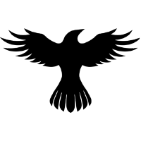

.. Ravnest documentation master file, created by
   sphinx-quickstart on Tue Apr  2 12:15:46 2024.
   You can adapt this file completely to your liking, but it should at least
   contain the root `toctree` directive.

|logo| **Welcome to Ravnest's documentation!**
##############################################

Ravnest is an asynchronous decentralized training framework for large modern deep learning models that harnesses the compute power of regular heterogeneous PCs with limited resources connected across the internet to achieve favourable performance metrics. It enables decentralized training by effectively grouping compute nodes into clusters with comparable data transfer speeds and computing capabilities, eliminating the need for each node to host the entire model.

.. warning::

   Ravnest is in the throes of active development. Brace yourselves for updates! What you see today may not be what you encounter tomorrow. 🌪️

.. toctree::
   :maxdepth: 2
   :caption: Table of Contents

   quickstart
   api
   local
   nodes
   contributing

Indices and tables
==================

* :ref:`genindex`
* :ref:`modindex`
* :ref:`search`
