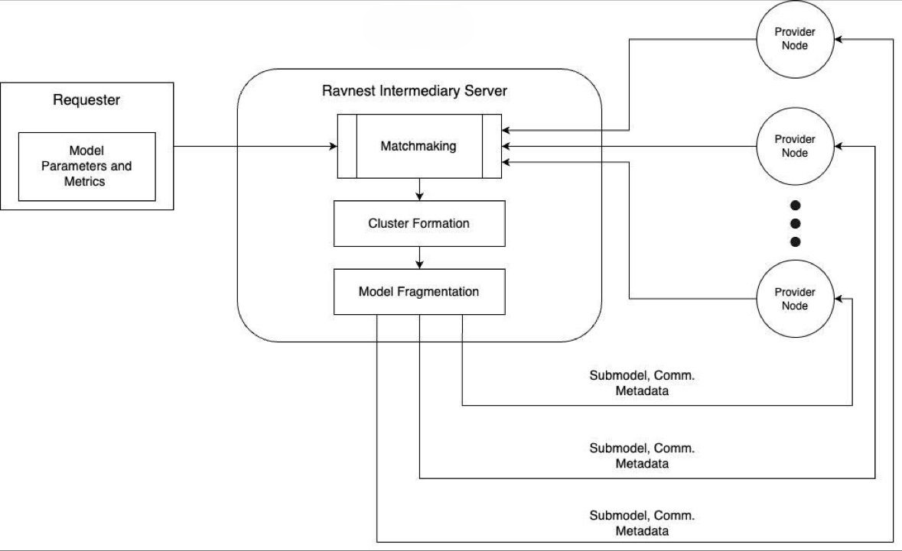

Roles in Ravnest Ecosystem
==========================

.. role:: raw-html(raw)
    :format: html
    
:raw-html:` `

Requester
---------

In the Ravnest ecosystem, a ``Requester`` is an entity seeking to utilize decentralized training for training their deep learning model. The primary responsibilities of a Requester include:

- Providing the model
- Supplying the dataset
- Defining dataset pre-processing methods
- Setting other training parameters such as optimizer and criterion

As a python module, Ravnest enables Requesters to prepare a consolidated script that will be shared with the compute providers to orchestrate distributed learning. Under the hood, based on the type and availability of compute nodes, Ravnest ingeneously breaks down the Requester's model with high abstraction into sub-models that are shared with the compute providers.

.. _provider-reference-label:

Provider
--------

A ``Provider`` contributes idle compute power to train the Requester's deep learning model. Providers receive a standardized script prepared by Requesters via the Intermediary Server, along with the corresponding sub-model, dataset chunk, and additional metadata. 

Despite the varied responsibilities and functions these providers undertake, the coding structure they follow remains consistent. This uniformity in code facilitates seamless integration and interaction within the system, ensuring that each provider, regardless of its specific role, adheres to the same standards and protocols. As a result, the system maintains coherence and efficiency, with the appearance of identical codes masking the diverse and specialized functions performed under the hood by different providers.

During a training session, each participating Provider node assumes one of the following roles:

Root
~~~~

The Root Provider is the primary entry point for data within a Ravnest cluster. This node is crucial as it:

- Initial Data Ingestion: Receives the raw data and initiates the data flow into the cluster.
- Preprocessing and Distribution: Performs initial preprocessing of the data if necessary and passes on the processed data to the Stem nodes.
- Single Node: There can only be one Root Provider in each cluster, ensuring a single point of entry and a structured data flow.

Stem
~~~~

Stem Providers act as intermediaries between the Root and Leaf nodes within the cluster. Their main responsibilities include:

- Data Relay: Forwarding data from the Root node to the Leaf node and vice versa.
- Computation: Performing forward and backward passes of the neural network, contributing to the training process.
- Flexibility in Numbers: A cluster can have multiple, one, or even no Stem nodes depending on the network architecture and the number of available compute nodes.
- Load Balancing: Assisting in balancing the computational load by breaking down the model and handling significant portions of the computation.

Leaf
~~~~

The Leaf Provider marks the end point of the data flow in a cluster and is responsible for:

- Final Computation: Performing the final calculations, such as the evaluation of the training loss, which is critical for updating the model. This also requires the Leaf Provider to host the correct True Labels of the Cluster's dataset in the right order.
- Backpropagation: Triggers sending of gradients back through the Stem nodes to the Root node to adjust the model parameters.
- Single Node: There can only be one Leaf Provider in each cluster (at the end).

Each of these roles within the Ravnest ecosystem is designed to optimize the distributed training process by leveraging the unique capabilities of different compute nodes, ensuring a seamless and efficient training workflow.

Training Pipeline
-----------------

During the forward pass, the Root Provider begins by preprocessing the input data and feeding it into the distributed training pipeline. The Root processes the initial layers of the model and sends the intermediate outputs to the Stem Providers. The Stem Providers, situated in the middle of the pipeline, take these intermediate outputs and perform further computations on them. Essentially, they handle a segment of the model's layers, passing their outputs along to the next node, which could be another Stem Provider or a Leaf Provider. This step-by-step processing allows for efficient handling of large models by distributing the workload across multiple nodes.

In the backward pass, the gradient information needed for updating the model parameters flows in the opposite direction. The Leaf Providers, which are at the end of the pipeline, calculate the initial gradients based on the loss function. They then send these gradients back to the Stem Providers. The Stem Providers receive the gradients, compute the necessary updates for their segment of the model, and pass the gradient information further back to the Root Providers. This hierarchical gradient flow ensures that all parts of the model are updated correctly while balancing the computational load.

Intermediary Server
-------------------

The ``Intermediary server`` allows Requesters to connect, share their deep learning models, and split these models based on available Provider nodes. They group Provider nodes into clusters and distribute the relevant sub-models and communication metadata to the appropriate Providers.

.. note::
    The Intermediary Server can be hosted directly on the Requester's machine, enabling seamless integration and efficient resource utilization. By hosting the server locally, the Requester gains direct control over the distribution process, ensuring data privacy and reducing latency. This setup allows the Requester's machine to handle the splitting of the deep learning model, grouping of Provider nodes, and dissemination of sub-models and communication metadata without relying on external infrastructure. As a result, the entire orchestration of decentralized training remains within the Requester's environment, enhancing security and potentially speeding up the training process by minimizing external dependencies.